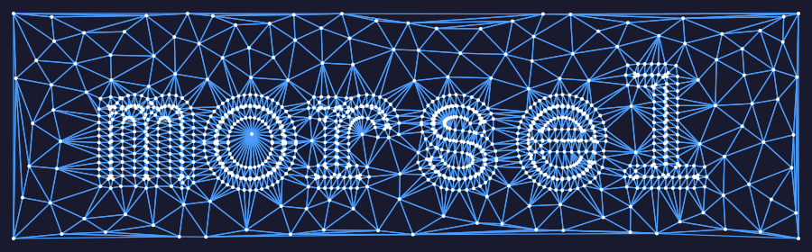

# morsel

<picture>
  <source media="(prefers-color-scheme: dark)" srcset="images/morsel_banner_dark.svg">
  <source media="(prefers-color-scheme: light)" srcset="images/morsel_banner_light.svg">
  
</picture>

Mesh processing in Rust

## Tools

### morsel

Command-line tool for mesh processing algorithms.

**Install:**
```bash
cargo install --path . --features cli
```

**Commands:**

| Command | Description |
|---------|-------------|
| `info` | Display mesh information (vertices, faces, area, curvature) |
| `smooth` | Smooth a mesh (laplacian, taubin, cotangent) |
| `subdivide` | Subdivide a mesh (loop, catmull-clark) |
| `decimate` | Simplify a mesh using QEM |
| `remesh` | Remesh to improve triangle quality |

**Examples:**
```bash
# Show mesh info
morsel info model.obj
morsel info model.obj --curvature

# Smooth a mesh
morsel smooth input.obj output.obj --method taubin --iterations 5

# Subdivide a mesh
morsel subdivide input.obj output.obj --method loop --iterations 2

# Decimate to 50% of faces
morsel decimate input.obj output.obj --ratio 0.5

# Decimate to exactly 1000 faces
morsel decimate input.obj output.obj --faces 1000

# Remesh with target edge length
morsel remesh input.obj output.obj --target-length 0.1
```

Run `morsel <command> --help` for detailed options.

---

### morsel-view

A 3D mesh viewer for inspecting meshes with optional texture support.

**Install:**
```bash
cargo install --path . --features viewer
```

**Usage:**
```bash
morsel-view path/to/mesh.obj
morsel-view mesh.obj --texture texture.png --parameterize
```

**Options:**

| Option | Description |
|--------|-------------|
| `--texture <file>` | Load a texture image (PNG, JPG, etc.) |
| `--parameterize` | Compute UV coordinates (cylindrical projection) |

Supported mesh formats: `.obj`, `.stl`, `.ply`, `.gltf`, `.glb`

**Controls:**

| Input | Action |
|-------|--------|
| Left mouse drag | Rotate camera |
| Scroll wheel | Zoom in/out |
| `W` | Toggle wireframe |
| `B` | Toggle backface culling |
| `T` | Toggle textured mode |
| `R` | Reset camera |
| `Escape` | Quit |
