# morsel

<picture>
  <source media="(prefers-color-scheme: dark)" srcset="images/morsel_banner_dark.svg">
  <source media="(prefers-color-scheme: light)" srcset="images/morsel_banner_light.svg">
  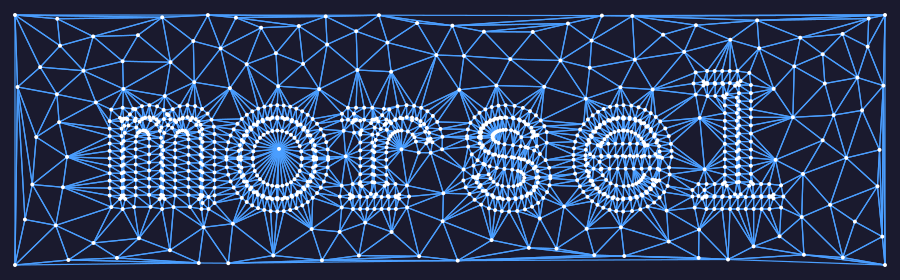
</picture>

[](https://github.com/timthirion/morsel/actions/workflows/ci.yml)

Mesh processing in Rust

> 📐 Direction lives in [`plans/ROADMAP.md`](plans/ROADMAP.md); conventions live in
> [`AGENTS.md`](AGENTS.md).

## Gallery

Every image below is produced by the CLI and the viewer in this repository, from the
meshes in [`examples/`](examples/), with the commands shown. Regenerate any of them
with `morselview … --screenshot`.

<p align="center">
  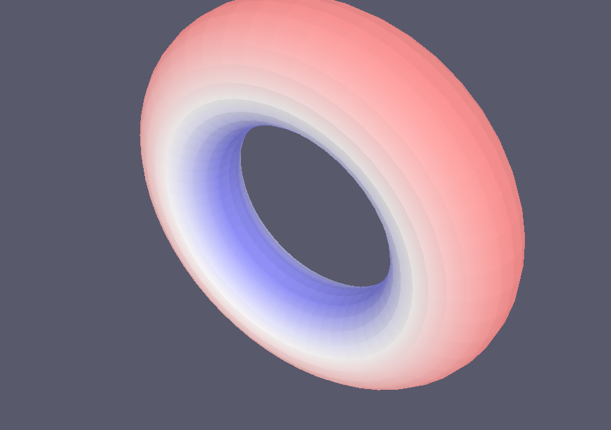
  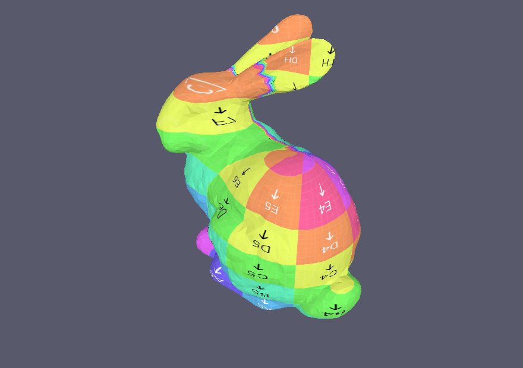
</p>

**Left — Gaussian curvature.** Red is positive, blue negative. The colouring is not
decorative: on this torus (`R = 1`, `r = 0.35`) the analytic curvature runs from
`+2.116` on the outer equator to `−4.396` on the inner, and the estimator lands
within 1% of both, which `tests/curvature_analytic.rs` asserts.

```sh
morselview examples/torus.obj --curvature gaussian --screenshot out.png
```

**Right — UV parameterization,** shown with a test grid texture. The ragged seam down
the bunny's left side is where cylindrical projection wraps at `atan2`'s branch cut,
and is exactly the artefact a conformal method avoids. LSCM and ARAP need disk
topology, which this mesh does not have — it has four boundary loops around the base
— so reaching them means cutting it open first, with `--cut`.

```sh
morselview examples/stanford-bunny.obj --texture images/UV.png --screenshot out.png
```

### Cutting a surface open to flatten it

<p align="center">
  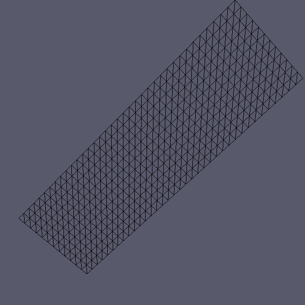
  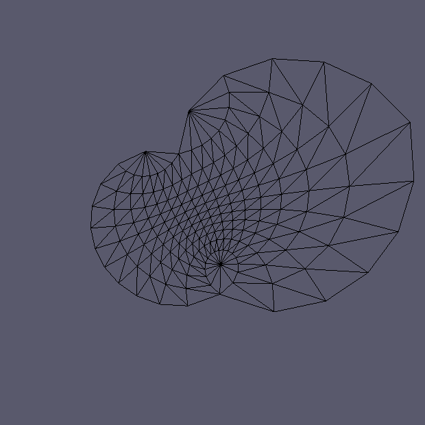
</p>

Both images are the **UV layout** rather than the 3D mesh: every vertex moved to
`(u, v, 0)`, which is what `--layout` writes. Looking at the layout is how you check a
flattening — a fold or a collapsed region is obvious here and nearly invisible on the
textured model.

**Left — a cylinder,** which starts with two boundary loops. One cut between them
merges the loops, and the result unrolls to a rectangle. Not approximately: the area
ratio is `1.000` on all 864 faces, to within `1.1e-10`. That is the right answer
rather than a lucky one, because a cylinder is *developable* — it can be flattened
without stretching at all, the isometric unrolling therefore has zero conformal
energy, and so it is exactly what LSCM's minimisation finds. The 45° tilt carries no
meaning: the map is fixed only up to a similarity, set by which two vertices LSCM
pinned.

**Right — a sphere,** which is closed and so has no loop to merge; a single slit opens
it instead. The whole outline of that shape *is* the cut: the slit's two sides, twelve
edges each, pulled apart by the flattening and meeting only at the two *tips*. The
tips are the one place the cut deliberately leaves a vertex unduplicated — splitting a
slit's endpoints would tear the surface into two pieces rather than open it. A sphere
is not developable, so distortion is unavoidable here and the area ratio runs from
`0.16` to `8.1`; the tightest knot of triangles is the mesh's 16-valent pole, not
anything to do with the seam.

```sh
morsel parameterize examples/cylinder.obj cyl.obj --method lscm --cut --layout cyl-layout.obj
morselview cyl-layout.obj --wireframe --azimuth 0 --elevation 0 --distance 1.3 \
  --size 620x620 --screenshot out.png
```

<p align="center">
  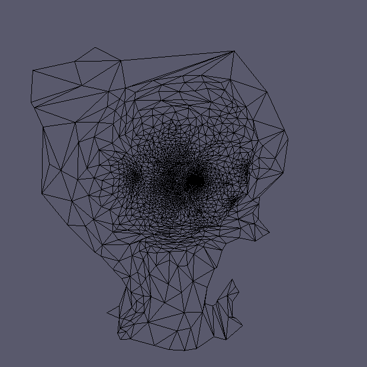
</p>

**Where this stops being good enough.** The bunny's four holes are joined by three
cuts, each the shortest path available — and a shortest path is *short*, not well
placed. LSCM's worst area ratio on the result is `50.3`, and its smallest triangle
gets `2e-9` of the area it should; the dark blobs are hundreds of triangles piled into
a few pixels. Nothing is wrong topologically, and this is the honest state of the
seam placement: the cut generator solves the topology, and choosing *where* to cut so
the flattening is usable is a separate problem, tracked in
[`plans/ROADMAP.md`](plans/ROADMAP.md).

```sh
morsel parameterize examples/stanford-bunny.obj bunny.obj --method lscm --cut --layout bunny-layout.obj
morselview bunny-layout.obj --wireframe --azimuth 0 --elevation 0 --distance 1.35 \
  --size 620x620 --screenshot out.png
```

### Geodesic distance

<p align="center">
  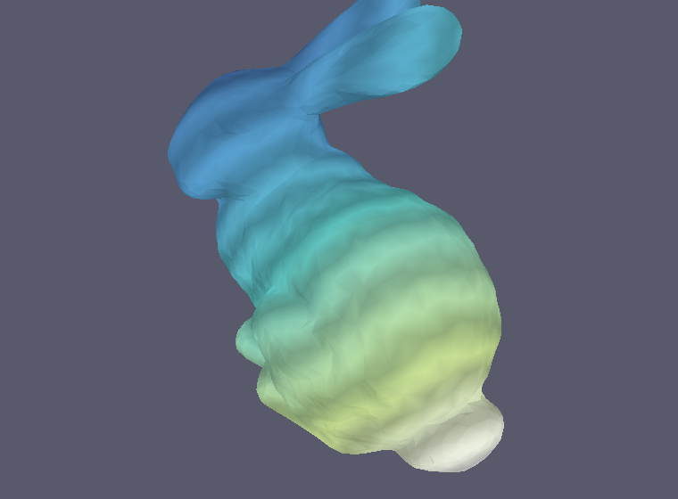
</p>

Distance from a single source vertex on the bunny's head, by the heat method — two
linear solves rather than a graph search, so distance is measured *across* faces
rather than along edges. The bands are the readable part: evenly spaced rings mean
the field really is a distance, and they would bunch or kink where it is not.

`--geodesic-dijkstra` colours by graph distance instead. On this mesh the two look
nearly identical, because the bunny is triangulated finely enough that edges
approximate geodesics well — so there is deliberately no side-by-side here. The gap
opens on coarser or more structured meshes: on `cylinder.obj`, whose geodesics are
helices that follow no edge, Dijkstra overestimates by 15% on average and up to 41%,
which `tests/geodesic_analytic.rs` asserts against the exact unrolled answer.

```sh
morselview examples/stanford-bunny.obj --geodesic 0 --screenshot out.png
```

### Smoothing: Laplacian shrinks, Taubin does not

<p align="center">
  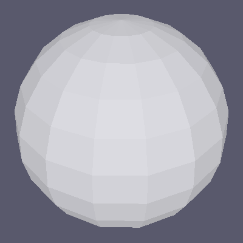
  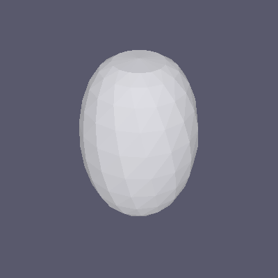
  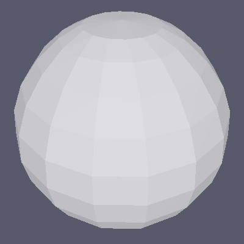
</p>

Original, then 20 iterations of Laplacian and of Taubin smoothing at `λ = 0.5`. All
three use the **same camera**, so the sizes are directly comparable — Laplacian loses
**79%** of the volume while Taubin gains 1.8%, which is the shrinkage resistance it is
named for. Note also that uniform Laplacian weights distort the shape into an egg,
because this sphere's triangulation is denser near the poles; that is what cotangent
weights exist to fix.

```sh
morsel smooth examples/sphere.obj out.obj --method taubin --iterations 20
morselview out.obj --screenshot out.png --distance 1.45
```

### Loop subdivision: 12 → 48 → 192 faces

<p align="center">
  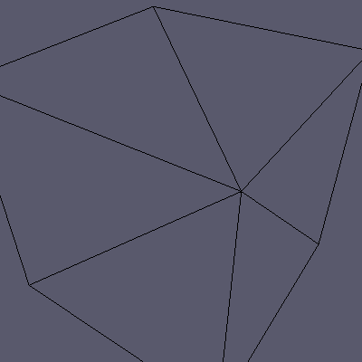
  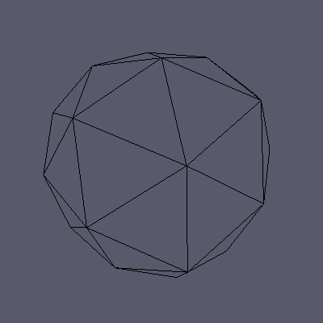
  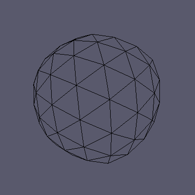
</p>

Each step splits every triangle into four and preserves the Euler characteristic
exactly. The surface also visibly contracts, which is correct rather than a bug: Loop
is an approximating scheme, so the limit surface lies inside its control mesh. Here
the volume goes `1.000 → 0.476 → 0.397`, converging.

```sh
morsel subdivide examples/cube-closed.obj out.obj --method loop --iterations 2
morselview out.obj --screenshot out.png --distance 1.8 --wireframe
```

## Tools

### morsel

Command-line tool for mesh processing algorithms.

**Install:**
```bash
cargo install --path . --features cli
```

**Commands:**

| Command | Description |
|---------|-------------|
| `info` | Display mesh information (vertices, faces, area, curvature) |
| `smooth` | Smooth a mesh (laplacian, taubin, cotangent) |
| `subdivide` | Subdivide a mesh (loop, catmull-clark) |
| `decimate` | Simplify a mesh using QEM |
| `remesh` | Remesh to improve triangle quality |
| `parameterize` | Compute UV coordinates (cylindrical, LSCM, ARAP, OMT) |
| `geodesic` | Geodesic distance from a source vertex (heat method, Dijkstra) |

**Examples:**
```bash
# Show mesh info
morsel info model.obj
morsel info model.obj --curvature

# Smooth a mesh
morsel smooth input.obj output.obj --method taubin --iterations 5

# Subdivide a mesh
morsel subdivide input.obj output.obj --method loop --iterations 2

# Decimate to 50% of faces (deterministic: same input, same output, bit for bit)
morsel decimate input.obj output.obj --ratio 0.5

# Decimate to exactly 1000 faces
morsel decimate input.obj output.obj --faces 1000

# Remesh with target edge length
morsel remesh input.obj output.obj --target-length 0.1

# Curvature-adaptive, or CVT resampling to a vertex budget
morsel remesh input.obj output.obj --method anisotropic
morsel remesh input.obj output.obj --method cvt --target-vertices 500

# Triangle-quality statistics on their own
morsel quality examples/stanford-bunny.obj

# UV-unwrap an open (disk-topology) mesh, angle-preserving
morsel parameterize patch.obj patch_uv.obj --method lscm

# Area-preserving: LSCM followed by an optimal-mass-transport correction
morsel parameterize patch.obj patch_uv.obj --method omt

# Cut a non-disk mesh open first, and flatten in one step
morsel parameterize sphere.obj sphere_uv.obj --method lscm --cut

# Or cut on its own, to inspect the seams
morsel cut examples/stanford-bunny.obj bunny_cut.obj
```

```sh
# Geodesic distance, and the graph distance it improves on
morsel geodesic examples/spherical-cap.obj --source 0 --target 200
morsel geodesic examples/spherical-cap.obj --source 0 --method dijkstra
```

`lscm`, `arap` and `omt` require **disk topology** — exactly one boundary loop. A
closed mesh has none and an annulus has two, and both are refused by name rather
than silently producing a degenerate map. `--cut` gets there first: `cut` joins
boundary loops along the shortest path between them, and slits a closed surface
open, so the sphere, the cylinder and the bunny all become flattenable. It refuses
genus > 0 — a torus needs handle loops that no shortest path between boundaries will
find — and refuses disconnected input, since the genus is a sum over components.
`omt` reports area distortion before and after, so the correction it applies is
visible.

Cutting is pure surgery: it duplicates vertices along the seam and rewires face
corners, leaving every face and every position exactly where it was. It is the seam
*placement* that is unambitious — a shortest path is short, not well placed, and a
short slit on a sphere leaves a lot of distortion behind (LSCM's worst area ratio on
the cut sphere is 8.1). Choosing seams to minimise distortion is a separate problem.

Every command that mutates a mesh says whether it actually did the work. These algorithms
rebuild through `build_from_triangles`, and a rebuild it rejects leaves the mesh untouched
— which used to pass in silence, so Catmull-Clark would return a triangle mesh unchanged
as though it had subdivided it. `RemeshReport`, `SubdivideReport` and `DecimateReport` are
`#[must_use]`, so a library caller cannot ignore them by accident either.

`decimate` is deterministic and hits its target. It reaches the requested face count on
every bundled mesh, on the first attempt, and gives byte-identical output for the same
input. Both of those were recently untrue: the collapse order depended on hash iteration
order, and a stale boundary flag let through one collapse that made the bunny's result
unrepresentable, so it silently delivered 3725 faces where 2484 were asked for. When a
target genuinely cannot be reached — a two-triangle mesh cannot become one triangle — it
says so rather than reporting success.

`remesh` reports triangle quality before and after, because that is the claim it is
making. **Use `isotropic`** unless you have a reason not to — it is the only one of the
three that reliably improves quality, and `tests/remesh_quality.rs` measures all of
them against [`src/algo/quality.rs`](src/algo/quality.rs) to say so. `anisotropic`
improves the *mean* everywhere but takes the cylinder's worst angle from 43.7° down to
about 10°, and `cvt` needs `--target-vertices` below the input count or Lloyd's
iteration has nothing to move. None of the three projects vertices back onto the input
surface, so all of them shrink it — by 2.7%, 1.2% and 15% respectively on a sphere of
radius 0.5.

That reporting is worth having for a specific reason: on the bunny, isotropic remeshing
lifts the mean minimum angle from 35.9° to 51.4° and the mean radius ratio from 0.74 to
0.95 — its best aggregate result anywhere — while emitting one triangle with an angle of
`5.5e-8°`. Worst and mean can point in opposite directions, so `quality` prints both,
along with a 10° histogram of minimum angles.

`geodesic` defaults to the heat method, which measures distance across faces.
`--method dijkstra` walks the edge graph instead and can only overestimate — by 15%
on average and up to 41% on `cylinder.obj`, whose geodesics are helices that follow
no edge.

Run `morsel <command> --help` for detailed options.

## Viewer

`morselview` renders a mesh interactively, and will also render one frame straight
to a PNG, which is how every image in the gallery above was produced.

```sh
cargo build --release --features viewer

# Interactive: drag to orbit, scroll to zoom, W wireframe, C vertex colours
./target/release/morselview examples/torus.obj --curvature gaussian

# Offscreen: no window, no display needed
./target/release/morselview examples/torus.obj --curvature gaussian \
    --screenshot out.png --size 880x620
```

| Option | Effect |
|--------|--------|
| `--curvature mean\|gaussian` | Colour vertices by curvature |
| `--geodesic <vertex>` | Colour by geodesic distance from a source, with isolines |
| `--geodesic-dijkstra` | Use graph distance instead of the heat method |
| `--texture <file>` | Apply a texture, using UVs from the mesh |
| `--parameterize` | Compute cylindrical UVs first |
| `--screenshot <file>` | Render one frame to PNG and exit |
| `--size WxH` | Screenshot size, default `1200x900` |
| `--azimuth`, `--elevation` | Camera angles in radians |
| `--distance <d>` | Fixed camera distance |
| `--wireframe` | Draw the wireframe instead of solid shading |

`--distance` matters for comparisons. Without it the camera frames each mesh to fill
the view, so a shrunken result renders at the same apparent size as its input and the
difference becomes invisible — which is why the smoothing row above passes the same
distance to all three.

---

### morselview

A 3D mesh viewer for inspecting meshes with optional texture support.

**Install:**
```bash
cargo install --path . --features viewer
```

**Usage:**
```bash
morselview path/to/mesh.obj
morselview mesh.obj --texture texture.png --parameterize
```

**Options:**

| Option | Description |
|--------|-------------|
| `--texture <file>` | Load a texture image (PNG, JPG, etc.) |
| `--parameterize` | Compute UV coordinates (cylindrical projection) |

Supported mesh formats: `.obj`, `.stl`, `.ply`, `.gltf`, `.glb`

**Controls:**

| Input | Action |
|-------|--------|
| Left mouse drag | Rotate camera |
| Scroll wheel | Zoom in/out |
| `W` | Toggle wireframe |
| `B` | Toggle backface culling |
| `T` | Toggle textured mode |
| `R` | Reset camera |
| `Escape` | Quit |
